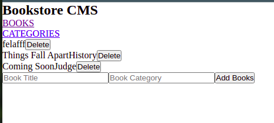

# BookStore

A web app book library that allows you add and and remove books

## Built With

- Javascript ES6
- React Js
- Redux

## To get a local copy run the following steps:
- Copy this link [this link](https://github.com/Whoistolu/bookstore)
- Open your terminal or command line
- Run "git clone Paste [this link](https://github.com/Whoistolu/bookstore)"
- Open the folder with your code editor
- Create a branch to work on

## Available Scripts

In the project directory, you can run:

### `npm start`

Runs the app in the development mode.\
Open [http://localhost:3000](http://localhost:3000) to view it in the browser.

## Authors

👤 **Author1**

- Name: Ajise Toluwase
- GitHub: [@githubhandle](https://github.com/Whoistolu)
- Twitter: [@twitterhandle](https://twitter.com/Littletolu)
- LinkedIn: [LinkedIn](https://www.linkedin.com/in/toluwase-ajise-9b40411b2/)

## 🤝 Contributing

Contributions, issues, and feature requests are welcome!

## Show your support

Give a ⭐️ if you like this project!

## Acknowledgments

- Hat tip to anyone whose code was used
- Inspiration

## 📝 License

This project is [MIT](./MIT.md) licensed.
